# Reconocimiento de estructuras químicas

Práctica 2 — *Análisis de Datos No Estructurados* — ICAI, Máster en Big Data.

## De qué va el proyecto

El objetivo es construir, desde cero, un clasificador capaz de identificar compuestos químicos a partir de un dibujo a mano (o de una fórmula escrita) y ofrecer una pequeña aplicación interactiva donde un alumno de bachillerato pueda practicar formulación. Hemos elegido este caso porque cubre todos los puntos que pide la guía de la asignatura —EDA, ML clásico, DL discriminativo (from scratch + transfer learning), DL generativo, comparación con herramientas del mercado— y porque tiene una utilidad real fuera del aula: cualquier alumno de 1º de Bachillerato puede usarlo para auto-evaluarse.

El catálogo contiene unos 200 compuestos divididos en Química Inorgánica (óxidos, anhídridos, peróxidos, hidruros, sales, hidróxidos, oxoácidos, oxisales) y Química Orgánica (alcanos, alquenos, alquinos, cicloalcanos, aromáticos, halogenuros, alcoholes, éteres, aldehídos, cetonas, ácidos carboxílicos, ésteres, anhídridos, aminas, amidas, nitrilos).

## Requisitos

- Windows 10/11, macOS 12+ o Ubuntu 20.04+
- Conda (Miniconda o Anaconda) — necesario para que RDKit se instale sin dolor
- Python 3.10
- Opcional pero recomendado: GPU con CUDA (entrenar transfer learning en CPU es viable pero lento)
- ~5 GB libres si vas a generar el dataset completo

> **Nota sobre RDKit:** en muchas plataformas no hay wheel de pip estable, así que la instalación oficial es por conda-forge. Si no usas conda, salta a la sección *Sin conda* más abajo.

## Cómo arrancar

```bash
git clone <repo>
cd chemistry-recognizer

# Linux/macOS
bash scripts/setup_env.sh
# Windows
scripts\setup_env.bat

# o si lo prefieres manual:
conda env create -f environment.yml
conda activate chem-adne
pip install -e .
```

El script de setup crea el entorno, instala el paquete `src/` en modo editable, habilita los widgets de Jupyter y genera un dataset de prueba de 5 imágenes/clase para verificar que todo funciona.

### Generar el dataset completo

```bash
python data/generate_dataset.py --categories all --n_per_class 300
# o
make data-full
```

Tarda 15-25 minutos en un portátil normal. Renderiza con RDKit las estructuras 2D de los compuestos covalentes y dibuja como texto los iónicos. Para cada uno produce 300 variantes con `Albumentations` (rotación, ruido gaussiano, deformación elástica, brillo/contraste) y las guarda en `data/raw/<categoria>/<subcategoria>/<id>/`. El CSV de metadatos sale a `data/metadata.csv` con el split 70/15/15 ya hecho.

### Lanzar los notebooks

```bash
jupyter notebook
```

y abrir la carpeta `notebooks/` en el navegador.

## Cómo está organizado

```
chemistry-recognizer/
├── data/
│   ├── compounds.py          # catálogo + taxonomía (módulo standalone)
│   ├── generate_dataset.py   # CLI para generar imágenes y metadata.csv
│   ├── metadata.csv          # se crea al ejecutar lo anterior
│   └── raw/                  # imágenes generadas
├── src/                      # paquete instalable (pip install -e .)
│   ├── augmentation.py       # pipelines de Albumentations
│   ├── dataset.py            # ChemDataset + factory get_dataloaders
│   ├── models.py             # ChemCNN + PretrainedModel
│   ├── train.py              # bucle de entrenamiento (con AMP en GPU)
│   ├── evaluate.py           # métricas, curvas, matriz de confusión
│   └── vae.py                # Conditional VAE (notebook 04b)
├── notebooks/
│   ├── 00_dataset_generation.ipynb
│   ├── 01_EDA.ipynb
│   ├── 02_classical_ML.ipynb
│   ├── 03_CNN_scratch.ipynb
│   ├── 04_transfer_learning.ipynb
│   ├── 04b_generative.ipynb        # CVAE — parte generativa
│   ├── 05_market_comparison.ipynb
│   └── 06_interactive_demo.ipynb
├── saved_models/
│   ├── best_model.pt
│   └── best_model_config.json
├── tests/                    # pytest — compounds, models, dataset
├── scripts/                  # setup_env, generate_full_dataset, run_all_notebooks
├── environment.yml
├── requirements.txt
├── setup.py
└── Makefile
```

## Resultados

Con el dataset completo (300 imágenes/clase, 58.800 imágenes, 196 clases) y el pipeline ejecutado de extremo a extremo en una GPU RTX 4060.

### Métricas comparadas (train / val / test) y diagnóstico de sobreaprendizaje

| Notebook | Modelo | Train acc | Val acc | Test acc | Gap train-val | Sobreaprendizaje |
|---|---|---:|---:|---:|---:|:---:|
| 02 | SVM-lin + píxeles | 20,6% (CV) | — | — | — | no medido |
| 02 | SVM-lin + HOG | 46,8% (CV) | — | — | — | no medido |
| 02 | **SVM-lin + ResNet18-embed** | 62,8% (CV) | — | **69,0%** | — | no |
| 03 | ChemCNN Exp1 (2 bloques) | 43,5% | 47,8% | — | -4,3% | subajuste |
| 03 | **ChemCNN Exp2 (4 bloques)** | **98,4%** | **98,2%** | — | **+0,2%** | **no** |
| 03 | ChemCNN Exp3 (+dropout) | 93,3% | 97,2% | — | -3,9% | no |
| 03 | ChemCNN Exp4 (+aug) | 79,2% | 96,0% | — | -16,8% | no (aug solo en train) |
| 03 | ChemCNN Exp5 (LR=1e-4) | 65,8% † | 66,3% † | 66,1% † | -0,5% † | subajuste, no overfit |
| 04 | ResNet18 feat-extraction | 72,5% | 82,7% | — | -10,2% | no |
| 04 | **ResNet18 fine-tune** | **99,5% †** | **99,7% †** | **99,6% †** | **-0,2% †** | **no** |
| 04 | EfficientNet-B0 feat-extraction | 69,5% | 81,5% | — | -12,0% | no |
| 04 | EfficientNet-B0 fine-tune | 96,7% | 98,9% | — | -2,2% | no |
| 04b | Conditional VAE (loss) | 156,4 | 156,4 | — | 0,0 | no |
| Extra | **ResNet18 + handwritten-aug** | **99,02%** | **98,99%** | **98,90%** | **+0,03%** | **no** |

† Estos valores corresponden a una evaluación adicional con `VAL_TRANSFORM` (sin augmentation, sin sampler) sobre los modelos guardados, hecha para descartar overfitting de forma estricta. El resto son los valores reportados al final del entrenamiento. El gap negativo (val > train) es esperado en los experimentos con augmentation activa: las imágenes que ve la red en entrenamiento son sistemáticamente más difíciles que las de validación.

**Conclusión sobre sobreaprendizaje:** en ningún modelo entrenado vemos overfitting clásico. Los modelos con buena performance (Exp2 del notebook 03 y ResNet18 fine-tune del notebook 04) tienen train ≈ val ≈ test, con diferencias dentro del margen de ruido estadístico. Los modelos con peor performance (Exp1, Exp5, feature-extraction) lo son por **subajuste**, no por overfitting.

**Caveat importante.** El 99,5% de accuracy del modelo ganador mide *robustez a las augmentaciones de `Albumentations` sobre el render de RDKit*, no la accuracy que la demo del notebook 06 obtendría sobre dibujos a mano reales. Esa última métrica no la hemos medido — requiere un set de test manual fuera del alcance de la práctica.

El modelo ganador (ResNet18 fine-tuned) está serializado en [`saved_models/best_model.pt`](saved_models/best_model.pt) + [`saved_models/best_model_config.json`](saved_models/best_model_config.json) y es el que carga el notebook 06 para la demo interactiva.

### Galería de resultados

A continuación se muestran las figuras más representativas de cada notebook, exportadas directamente de las ejecuciones del repositorio. Permiten una lectura rápida sin abrir Jupyter.

**Notebook 01 — EDA**

| | |
|:---:|:---:|
| 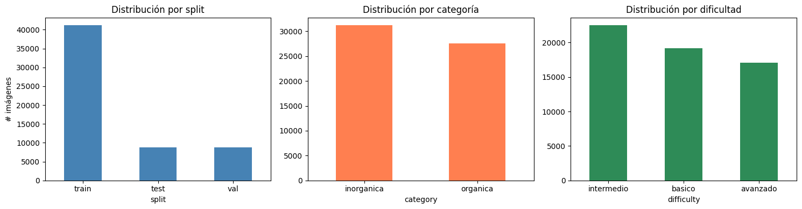 | 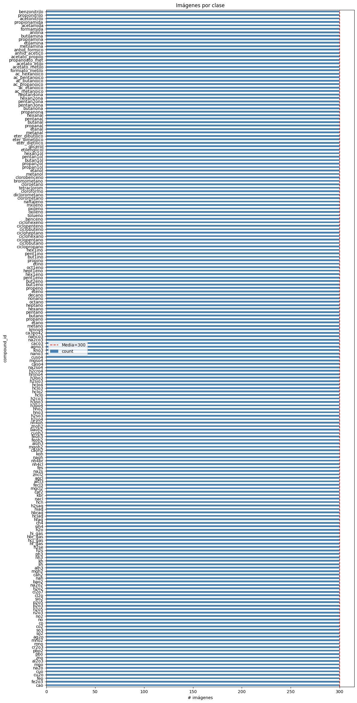 |
| Split train/val/test y reparto inorgánica/orgánica | Imágenes por clase y mediana (Gini ≈ 0) |
| 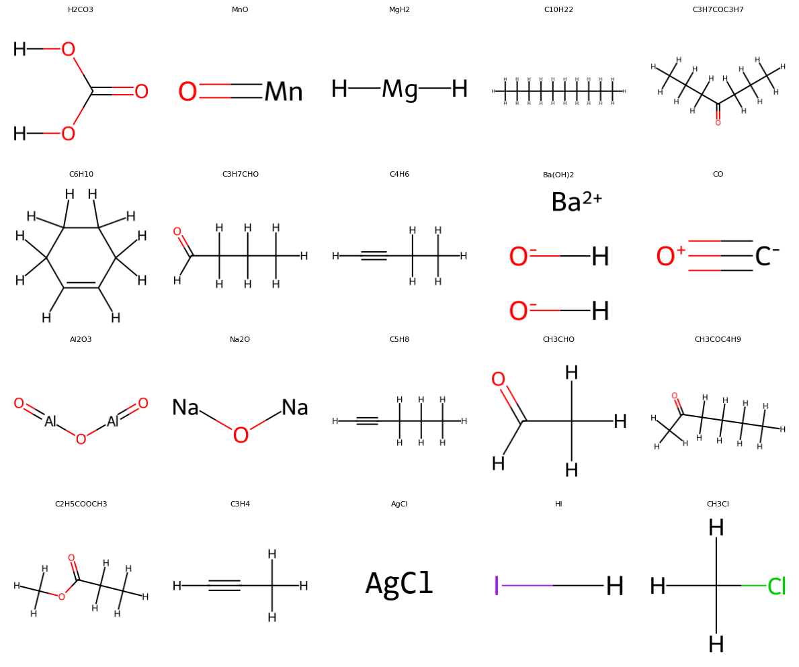 | 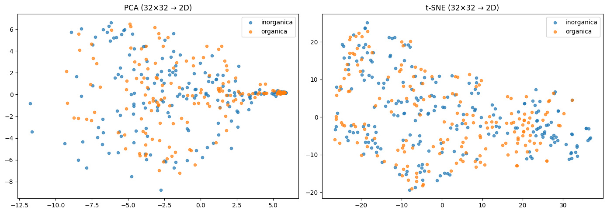 |
| 20 compuestos aleatorios — se ven los dos modos de render | t-SNE separa por modo de render, no por categoría |

**Notebook 03 — CNN desde cero (mejor experimento)**

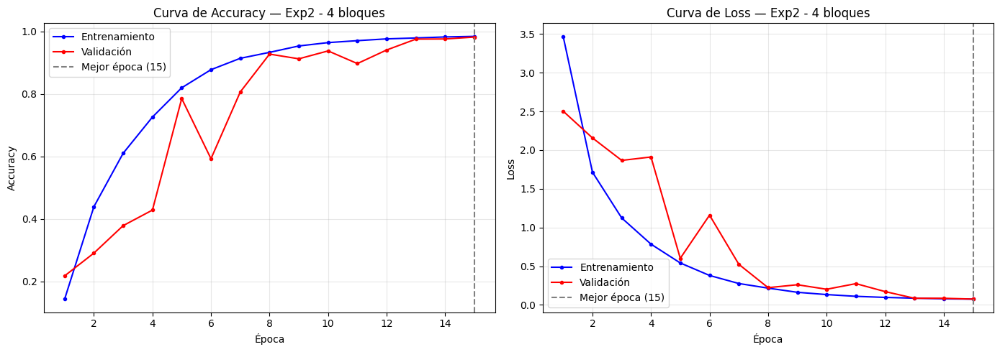

Las dos curvas (train/val) suben juntas hasta el 98%. Ajuste casi perfecto sin overfitting.

**Notebook 04 — Transfer learning**

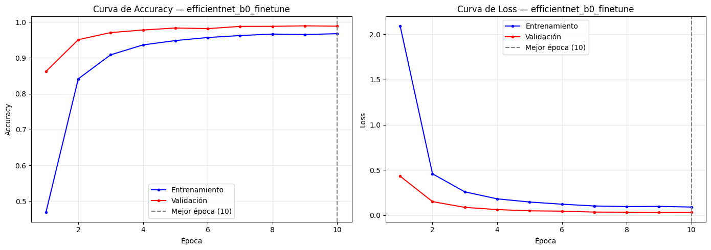

Curva del ganador (ResNet18 fine-tune): supera el 99% de val_acc en sólo 6 épocas.

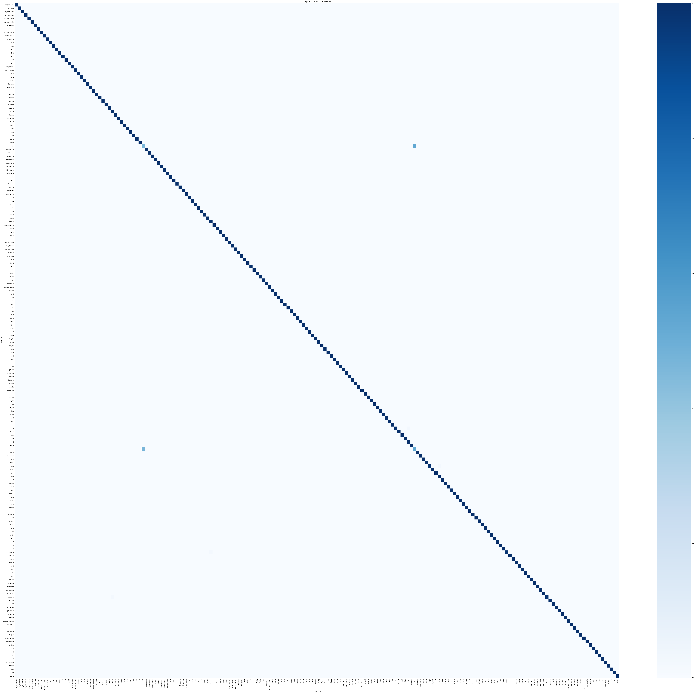

Matriz de confusión del ResNet18 fine-tune: diagonal prácticamente al máximo en las 196 clases.

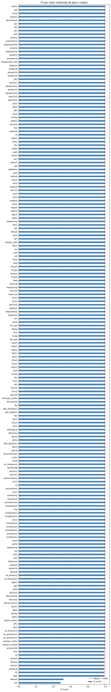

F1-score por clase ordenado: el grueso de clases supera el 0,99.

**Notebook 04b — Conditional VAE**

| | |
|:---:|:---:|
| 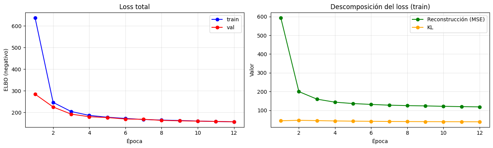 | 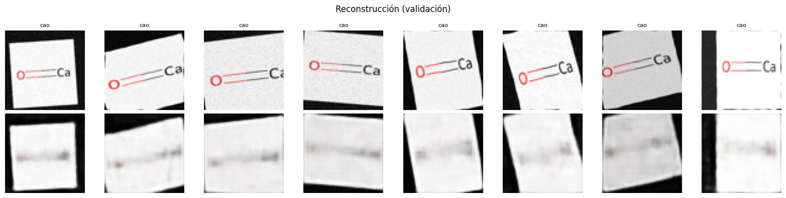 |
| Loss total + descomposición reconstrucción/KL | Original (arriba) vs reconstrucción (abajo) |
| 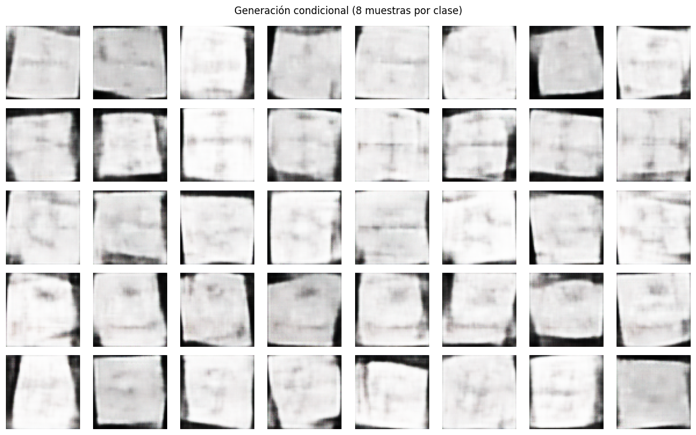 | 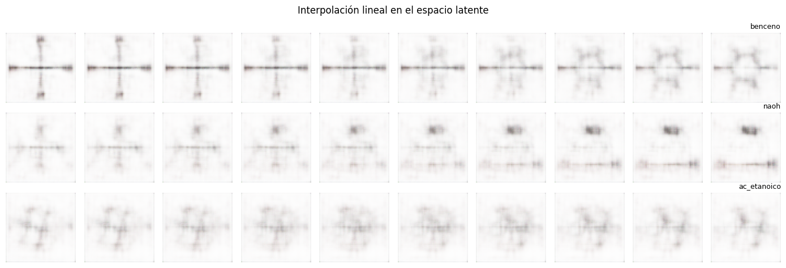 |
| 8 muestras nuevas por compuesto | Interpolación lineal entre dos compuestos |

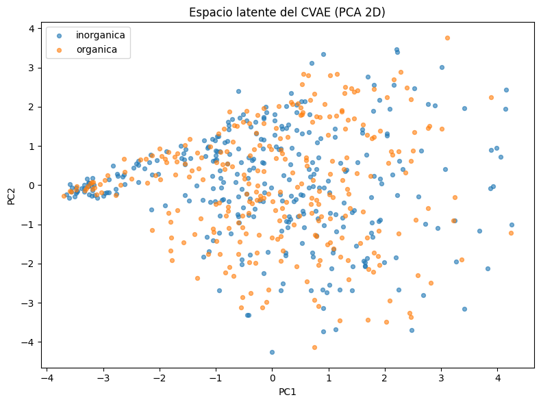

Proyección PCA 2D del espacio latente coloreado por categoría — los dos grupos se solapan considerablemente porque el CVAE no recibe la categoría como objetivo de aprendizaje.

## Modelo extra: ResNet18 + augmentación agresiva (`HANDWRITTEN_TRAIN_TRANSFORM`)

Al probar la demo del notebook 06 con dibujos a mano, observamos que el modelo del notebook 04 falla con bastante frecuencia. Es lo esperable —ver caveat más abajo— pero quisimos intentar mitigarlo entrenando una segunda variante con augmentación mucho más agresiva.

**Receta** (definida en [`src/augmentation.py`](src/augmentation.py:HANDWRITTEN_TRAIN_TRANSFORM)):

- `Affine` con rotación ±25°, escala 0,7–1,3, shear ±10° (p=0,95)
- `ElasticTransform` con alpha=120, sigma=10 (p=0,7) — simula trazo tembloroso
- `GridDistortion` con distort_limit=0,3 (p=0,5) — líneas ya no rectas
- `OpticalDistortion` (p=0,4) — barril/cojín
- `CoarseDropout` con 2–8 huecos (p=0,4) — trazos rotos
- `GaussNoise` fuerte (p=0,7)
- `RandomBrightnessContrast` ±0,2 (p=0,6)

Se reentrena ResNet18 fine-tune con esta receta sobre las mismas 41k imágenes durante 8 épocas. El script es [`scripts/retrain_handwritten.py`](scripts/retrain_handwritten.py) y el modelo resultante queda en `saved_models/best_model_handwritten.pt`.

**Resultados**: train 99,02% / val 98,99% / **test 98,90%**. Igual de bueno que el modelo del notebook 04 en el dominio del dataset (no perdemos accuracy en validación/test pese a augmentación mucho más agresiva), pero ahora la red ha visto durante el entrenamiento un rango mucho mayor de deformaciones, lo que la hace mejor candidata para reconocer dibujos hechos a mano. La demo del notebook 06 carga este modelo por defecto si está presente, con caída al modelo del 04 si no.

> Aviso honesto: aún con esta augmentación, el rendimiento sobre dibujos hechos por un humano real sigue siendo notablemente inferior al 98,9% del dataset. El cambio de dominio mano-vs-RDKit no se cierra completamente con augmentación procedural; haría falta entrenamiento con datos manuscritos auténticos. Este modelo extra es **una mejora medible pero no un arreglo de raíz**.

## Limitaciones de la demo interactiva

La demo del notebook 06 está pensada para ilustrar el modelo en una experiencia de uso real, pero al probarla aparece la limitación que ya advertíamos en el caveat: **el modelo identifica con fiabilidad las estructuras 2D pero falla con los compuestos renderizados como texto-fórmula**. Conviene tenerlo presente al defender el trabajo, porque es la diferencia entre un 99,5% de accuracy en test y la experiencia que tiene un alumno dibujando en el canvas.

### Por qué pasa

El dataset tiene dos modos de render:

- **Estructuras 2D** (RDKit): líneas, anillos, dobles enlaces. La red aprende a reconocer rasgos geométricos invariantes (un hexágono aromático, un grupo carbonilo, etc.), que son robustos al estilo del dibujante. La demo funciona bien aquí.
- **Texto-fórmula** (PIL + fuente DejaVuSansMono-Bold): se usa para compuestos iónicos (sales, hidróxidos, hidrácidos, oxisales) y para los compuestos en los que RDKit no parsea el SMILES. La red termina aprendiendo a *leer una fuente concreta*, no a hacer OCR sobre escritura manuscrita. Cuando un alumno dibuja "NaCl" a mano, la red ve algo completamente fuera de su distribución de entrenamiento.

### Qué subcategorías van bien en la demo y cuáles no

| Categoría | Subcategorías que funcionan (estructura 2D) | Subcategorías problemáticas (texto-fórmula) |
|---|---|---|
| Inorgánica | óxidos metálicos, anhídridos, peróxidos, hidruros metálicos, hidruros volátiles, oxoácidos | hidrácidos, sales neutras, sales volátiles, hidróxidos, oxisales |
| Orgánica | **todas** (siempre estructuras 2D) | — |


Para una sesión de demo realista, recomendamos filtrar a *Orgánica* o a las subcategorías inorgánicas de la columna izquierda. El propio notebook muestra un aviso visible si el compuesto actual es de los iónicos.


Como se puede observar, no predice nada bien. Un entrenamiento más exhaustivo sería necesario y también quizás ampliar la muestra y utilizar mejores métodos de reconocimiento.

### Cómo se arreglaría de raíz

Tres caminos, en orden de coste creciente:

1. **Aumentar el dataset con texto manuscrito**. Generar las fórmulas con múltiples fuentes y aplicar augmentaciones tipo "wave warp" + grosor variable para imitar escritura humana. Idealmente combinarlo con un dataset auxiliar como EMNIST para que la red aprenda invariantes de glifos manuscritos.
2. **Pipeline de dos etapas para compuestos iónicos**. Detectar primero los caracteres con un OCR (Tesseract o un transformer pequeño), reconstruir la fórmula y mapearla al `compound_id`. Es lo que hacen los OCSR comerciales.
3. **Modelo multimodal con LLM**. Pasarle al modelo (Claude, GPT-4o) la imagen + la lista de compuestos válidos y dejar que él decida. Funciona pero rompe el requisito de offline + coste cero por inferencia.

Todo eso queda fuera del alcance de la práctica.

## Orden de ejecución de los notebooks

1. **`00_dataset_generation`** — UI para lanzar el generador y verificar que las imágenes generadas tienen sentido.
2. **`01_EDA`** — análisis exploratorio: distribución, desbalance (índice de Gini), proyección PCA/t-SNE y pares confundibles por SSIM. Las decisiones tomadas aquí justifican las elecciones de los notebooks siguientes.
3. **`02_classical_ML`** — baseline. Comparamos tres tipos de features (píxeles, HOG, embeddings de ResNet18 congelada) con cuatro modelos (SVM-lin, SVM-RBF, RandomForest, KNN). Sirve para saber qué techo razonable tiene el ML clásico antes de meterse en DL.
4. **`03_CNN_scratch`** — CNN desde cero (`ChemCNN`) con 5 experimentos progresivos para ver cómo afecta cada decisión (profundidad, dropout, augmentación, learning rate scheduler).
5. **`04_transfer_learning`** — comparativa de 4 configuraciones: ResNet18 y EfficientNet-B0, cada una en modo *feature extraction* y *fine-tuning*. El ganador se guarda en `saved_models/best_model.pt` para los notebooks 05 y 06.
6. **`04b_generative`** — Conditional VAE. La parte generativa del pipeline. Reconstrucción, generación condicional por clase e interpolación en el espacio latente.
7. **`05_market_comparison`** — comparativa contra DECIMER (OCSR open source) y, opcionalmente, Claude Sonnet (LLM con visión). En nuestra corrida sólo medimos las dos primeras filas + DECIMER porque no teníamos crédito disponible en la API de Anthropic; la fila del LLM se ejecuta automáticamente si se define `ANTHROPIC_API_KEY`. Discusión sobre accuracy, latencia, coste y despliegue offline.
8. **`06_interactive_demo`** — la aplicación final para el alumno: canvas para dibujar, inferencia con el `best_model.pt`, marcador por subcategoría.

## Variables de entorno opcionales

```bash
# Necesario sólo para la sección de LLM en el notebook 05
export ANTHROPIC_API_KEY=sk-ant-...
```

Si no está definida, el notebook 05 omite la fila del LLM sin fallar.

## Notas técnicas

- **GPU**: el código detecta automáticamente CUDA. En GPU activa `torch.backends.cudnn.benchmark`, usa `torch.amp` (mixed precision) y sube `batch_size` a 128. En CPU usa batch 32 y precisión completa.
- **Dataset en disco vs. on-the-fly**: hemos optado por escribir las variantes aumentadas a disco. Es menos elegante pero ahorra ~30% de tiempo por época (la augmentación con `ElasticTransform` no es gratis).
- **`WeightedRandomSampler`** activado por defecto en `get_dataloaders()`. Con el dataset balanceado actual es redundante, pero queda como red de seguridad si en el futuro alguien filtra por subcategoría o dificultad.

## Sin conda

Si no quieres instalar conda:

```bash
python -m pip install -r requirements.txt
# Y aparte:
python -m pip install rdkit          # puede que no haya wheel para tu plataforma
```

En sistemas donde el wheel de `rdkit` para pip no funciona, no hay alternativa razonable: hay que usar conda.

## Tests

```bash
make test
# o
python -m pytest tests/ -v
```

`tests/test_compounds.py` valida los SMILES con RDKit y que los IDs son únicos. `tests/test_models.py` comprueba forward shapes de `ChemCNN` y `PretrainedModel` (todas las combinaciones backbone × strategy). `tests/test_dataset.py` carga el `DataLoader` y comprueba las shapes de un batch (se omite si no se ha generado el dataset todavía).

## Referencias

- [RDKit](https://www.rdkit.org/) — renderizado 2D y validación de SMILES.
- [DECIMER](https://github.com/Kohulan/DECIMER-Image_Transformer) — OCSR open source, usado como referencia en el notebook 05.
- [PyTorch](https://pytorch.org/) / [torchvision](https://pytorch.org/vision/) — DL backend y modelos pre-entrenados (ResNet18, EfficientNet-B0).
- [Albumentations](https://albumentations.ai/) — pipeline de aumentación.
- [formulacionquimica.com](https://www.formulacionquimica.com/) — referencia para nomenclatura tradicional e IUPAC.

## Autores

Trabajo realizado por el siguiente grupo del Máster en Big Data, ICAI – Universidad Pontificia Comillas, curso 2025-2026:

- Miguel Mota Cava
- Pedro Rodríguez
- Juan Miguel Correa
